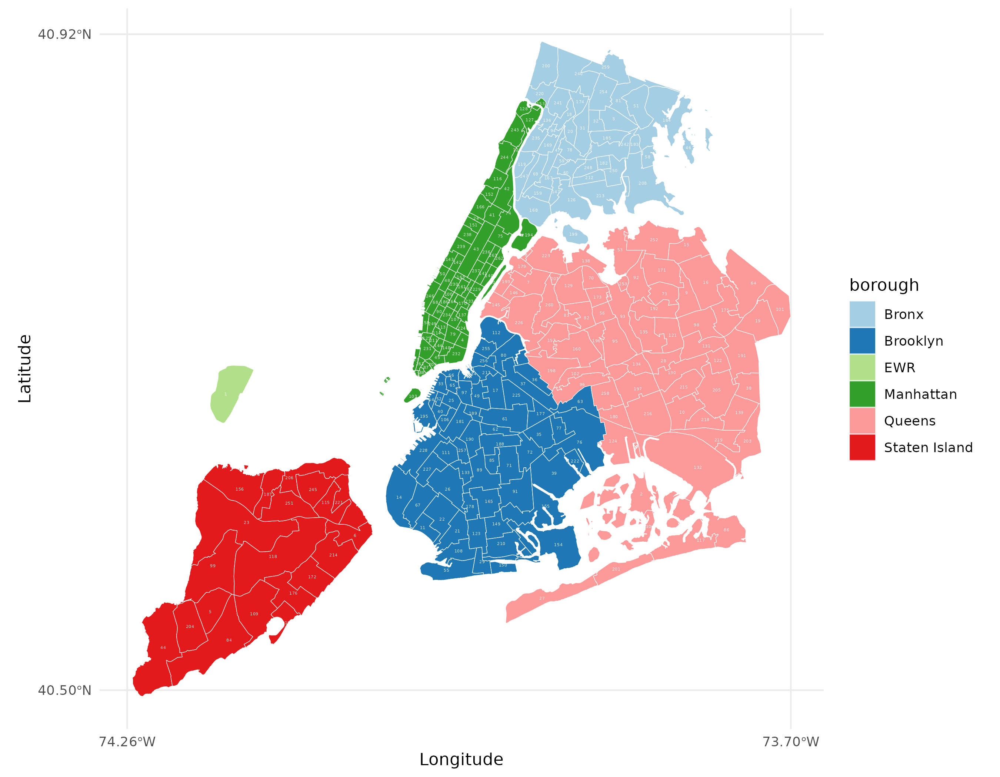
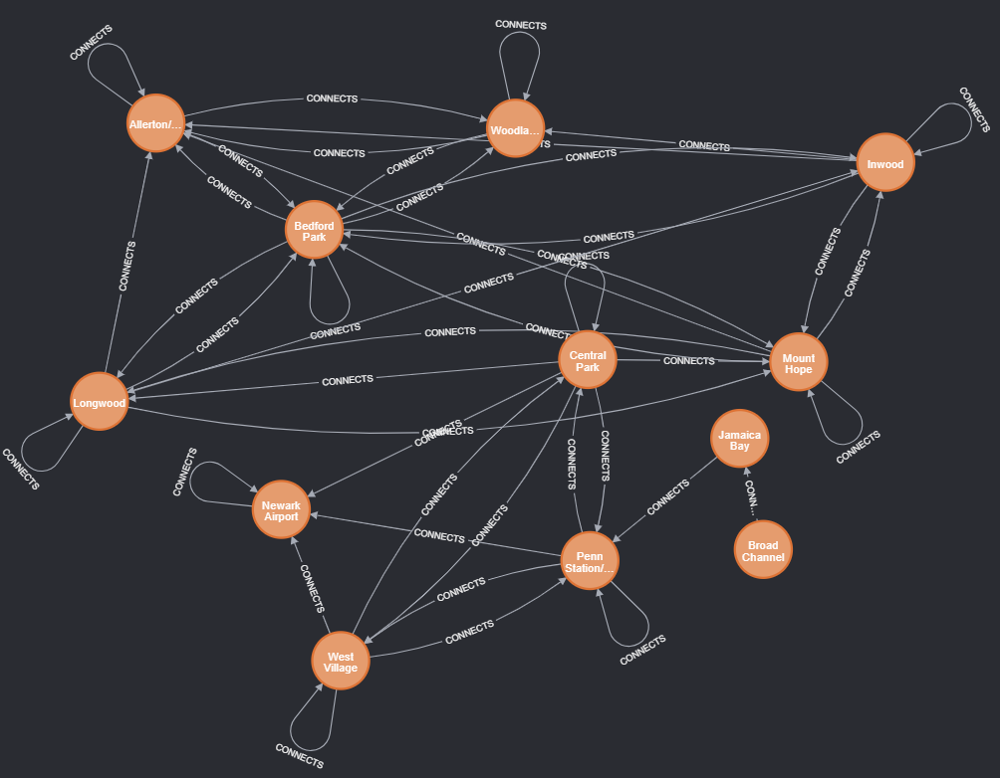

# CSC8101 - Neo4j Assignment

Contents:

- [Scenario](#scenario)
- [Task details](#task-details)
- [Deliverables](#deliverables)
- [Connection details](#connection-details)

## Scenario

A taxi company operating in New York City (NYC) is rethinking its fleet allocation strategy. Their
restructuring process is motivated by recent changes in passenger travel patterns (provoked by
Covid) and the arrival of new competitorsn. To minimise costs, the company wants to station its
fleet in a maximum of 20 city zones, spread across the city. At the same time, the company wants to
maximise trips served and therefore choose zones that have hub-like characteristics, i.e. that are
well-connected and near centres of high user activity. Lastly, the company considers operating
purely outside the Manhattan borough where there is less competition.

  

To help with this task, the taxi company contracts you to analyse its historical trip records and
recommend a list of city zones where they should station their fleets. To that end, the company
gives you a copy of its Neo4j graph database, available here, containing aggregate statistics of
taxi trips undertaken in 2021. There are two types of nodes: `borough` and `zone`. Two zones are
connected by a relationship of type `:CONNECTS` if a minimum of one trip was recorded between
them. In addition, `:CONNECTS` relationships have property `trips` representing the total number of
trips observed in the year. Lastly, a node is related to a borough via a relationship of type `:IN`. 

  

Based on preliminary exploration of the database and the NYC zones and boroughs map (shown above),
you decide to tackle the challenge by combining two methods of _network analysis_ available in the
[Neo4j Data Science Library](https://neo4j.com/docs/graph-data-science/current/). Your action plan
is divided into three parts:

1. Perform [community
   detection](https://neo4j.com/docs/graph-data-science/current/algorithms/community/) to identify
   clusters of strongly connected zones.
2. Perform [centrality
   analysis](https://neo4j.com/docs/graph-data-science/current/algorithms/centrality/) to measure
   the hub-like features of each zone.
3. Combine the results above by identifying the **top 3 zones** with **highest centrality** score within
   each **community** cluster. This processed is done twice for the entire city:
   1. once including Manhattan, and
   2. once excluding Manhattan.

In addition to your Neo4j analysis, you will use the visualisation app below to help interpret the
results of your network analysis and present them to your client (the taxi company). To use the app,
export your results at the end of each stage to a csv file and load it into the app (more details
given in each task).

- http://csc8101-neo4j-shiny.uksouth.cloudapp.azure.com/

## Task details

There are four tasks:

0. Find isolated nodes
1. Compute the community cluster of each node
2. Compute the centrality score of each node
3. Find the top centrality zones within each community

In task 0 you will develop a cypher query to find nodes and relationship of a certain type.

In tasks 1 and 2 you will execute two different algorithms available in the [Neo4j Data Science
Library (GDS)](https://neo4j.com/docs/graph-data-science/current/algorithms/). Both tasks follow the
typical workflow described [here](https://neo4j.com/docs/graph-data-science/current/common-usage/):

- Create an (in-memory) [graph
  projection](https://neo4j.com/docs/graph-data-science/current/common-usage/creating-graphs/).
- Estimate the memory necessary to run the algorithm (optional).
- Run the algorithm in [stats
  mode](https://neo4j.com/docs/graph-data-science/current/common-usage/running-algos/#running-algos-stats)
  to summarise the output of the algorithm.
- Run the algorithm in [stream
  mode](https://neo4j.com/docs/graph-data-science/current/common-usage/running-algos/#running-algos-stream)
  to run the algorithm but not store the results in the original graph.

> **Important:** Since everyone is reading from the same database, you will NOT execute write
queries to the database (create/update/delete) **NOR** run the GDS library algorithms in [merge
mode](https://neo4j.com/docs/graph-data-science/current/common-usage/running-algos/#running-algos-write)
(as this would cause the results to be written to the original graph, shared by everyone).

In task 3 you will develop a cypher query that combines the outcomes of tasks 1 and 2.

Due to database writing restrictions, the coursework is split across three neo4j databases - one for
Task 0, another for tasks 1 and 2 and a third for task 3. Go [here](#connection-details) for connection details.

### Task 0 - Find isolated nodes

Find all:

1. Self-pointing relationships, that is, all relationship instances of type `:CONNECTS` where the
   start node is the same as the end node.
2. Find all isolated nodes, i.e. all nodes that have no relationship instaces of type `:CONNECTS`
   to other nodes except possibly to themselves.

> **Important:** Do not delete the nodes/relationships found this way. Execute `MATCH` only queries.

### Task 1 - Community detection

Run the Louvain algorithm for community detection, available in the [GDS
library](https://neo4j.com/docs/graph-data-science/current/algorithms/louvain/), with the following
arguments:

- Graph projection of type `UNDIRECTED`.
- Name the graph projection as `USERNAME-communities` where USERNAME is your username (this
  is necessary to avoid naming conflicts between students).
- Weighted by the `trips` property in `:CONNECTS` type of relationships.

As specificed above, run the algorithm in 2 modes: `stats` and `stream`:

- Report the number of communities using the `stats` mode,
- Export the results of running the algorithm in `stream` as a CSV file with two columns `zone_id`
  and `community_id` and
- Visualise the results in the [app](http://csc8101-neo4j-shiny.uksouth.cloudapp.azure.com/) by
  uploading the produced csv file (right-click to download image).

> **Tip:** See the
[examples page](https://neo4j.com/docs/graph-data-science/1.8/algorithms/page-rank/#algorithms-page-rank-examples).
>
>  **Important:** Do not run the algorithm in `merge` mode.
>
>  **Note:** Isolated nodes have been removed for this task (reflecting the results of task 0).

### Task 2 - Centrality analysis

Run the Page Rank algorithm for centrality analysis, available in the [GDS
library](https://neo4j.com/docs/graph-data-science/current/algorithms/page-rank), with the following
arguments:

- Directed graph projection
- Name the graph projection as `USERNAME-centrality` where USERNAME is your username (this
  is necessary to avoid naming conflicts between students).
- Damping factor: 0.75
- Weighted by the `trips` property in `:CONNECTS` type of relationships.

As specificed above, run the algorithm in 2 modes: `stats` and `stream`:

- Report the maximum and minimum centrality score using the `stats` mode,
- Export the results of running the algorithm in `stream` as a CSV file with two columns `zone_id`
  and `centrality_score` and
- Visualise the results in the [app](http://csc8101-neo4j-shiny.uksouth.cloudapp.azure.com/) by
  uploading the produced csv file (right-click to download image).

> **Tip:** See the
[examples page](https://neo4j.com/docs/graph-data-science/1.8/algorithms/page-rank/#algorithms-page-rank-examples).
>
>  **Important:** Do not run the algorithm in `merge` mode.
>
>  **Note:** Isolated nodes have been removed for this task (reflecting the results of task 0).

### Task 3 - Zone recommendation

Find the top 3 highest centrality zones per each community:

1. Including zones in the 'Manhattan' borough. 
2. Excluding zones in the 'Manhattan' borough.

Do this using the available zone labels `community` (representing the community
id obtained in 1) and `centrality` (representing the centrality score obtained in 2).

For each case, return two columns: `zone_id` and `community_id` and export the query results to a
csv file. Then, using the visualisation
[app](http://csc8101-neo4j-shiny.uksouth.cloudapp.azure.com/), upload these (one at a time) to the
'Task-3' file input and produce a separate and produce two separate images.

> **Important:** Do not delete any nodes/relationships. Execute `MATCH` queries only.
>
> **Note:** Zone nodes now have two new properties - 'centrality' and 'community' (reflecting the result of tasks 1 and 2).

## Deliverables

You will submit the following deliverables to [NESS](https://ness.ncl.ac.uk):

1. Cypher queries for all tasks (0 to 3) in a single ".cypher" file, with comments clearly indicating where each task begins.
    - Task 0:
        - [ ] query 1
        - [ ] query 2
    - Task 1: cypher queries for
        - [ ] creating the graph projection
        - [ ] running the Louvain algorithm in 'stats' mode
        - [ ] running the Louvain algorithm in 'stream' mode
    - Task 2: cypher queries for
        - [ ] creating the graph projection
        -  [ ] running the Page Rank algorithm in 'stats' mode
        - [ ] running the Page Rank algorithm in 'stream' mode
    - Task 3:
        - [ ] query including Manhattan
        - [ ] query excluding Manhattan
2.  Visualisation images for tasks 1, 2 and 3. A total of 4 images are expected:
    - [ ] Task 1: zone community ids
    - [ ] Task 2: zone centrality scores
    - [ ] Task 3a: top 3 highest centrality score zones per each community, _including_ Manhattan
    - [ ] Task 3b: top 3 highest centrality score zones per each community, _excluding_ Manhattan

## Connection details

Neo4j connection details for each task.

### Task 0

- url: http://csc8101-neo4j-task0.uksouth.cloudapp.azure.com:7474/browser/
- Neo4j Connect URL: bolt://20.90.189.157:7687

### Tasks 1 and 2

- url: http://csc8101-neo4j-task1.uksouth.cloudapp.azure.com:7474/browser/
- Neo4j Connect URL: bolt://20.90.189.157:7687

### Task 3

- url: http://csc8101-neo4j-task3.uksouth.cloudapp.azure.com:7474/browser/
- Neo4j Connect URL: bolt://20.117.94.144:7687

### Username and Password

The Neo4j database username and password are the same in all instances:

- username: neo4j
- passowrd: neo4j

### Visualisation App

- url: http://csc8101-neo4j-shiny.uksouth.cloudapp.azure.com/