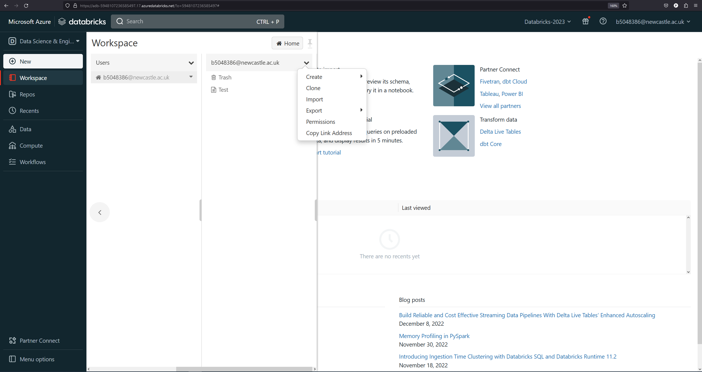

# CSC8101 - Big Data Analytics

- [Labs](01-labs/README.md)
- [Spark assignment](02-assignment-spark/CSC8101-spark-coursework.ipynb)
- [Neo4j assignment](03-assignment-neo4j/README.md)

## First practical - Accessing databricks

Databricks instance: https://adb-5948107236585497.17.azuredatabricks.net

To do:

- Verify that you have access to the databricks workspace.
- Check that you can only see **your** workspace folder and no one else's.
- Check that you can start and terminate clusters. Compute (left menu) -> Accessible by me (top menu
  tab).
- Create a notebook.
- Attach to an existing cluster (start cluster if none is available).
- Import a library of your choice: e.g. pandas or numpy.
- Write some code in a cell.
- Run the cell.
- Upload
  [this](https://github.com/NewcastleComputingScience/csc8101-coursework/blob/main/01-labs/notebooks/1-Spark-RDD-basics.ipynb)
  notebook and begin working through it.